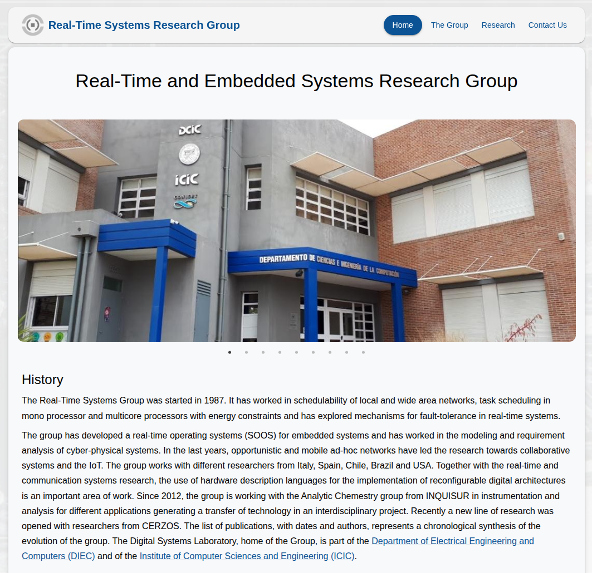

# Real-Time Systems Research Group Website

### Sitio web del Grupo de Investigación en Sistemas de Tiempo Real




*Requerimientos de software*: [npm](https://www.npmjs.com/) y [git](https://git-scm.com/)

Para descargar y compilar el sitio web ejecute los siguientes comandos en la terminal:

```bash
git clone https://github.com/sendevo/institucional-rtsg-uns.git # Descargar repositorio
cd institucional-rtsg-uns # Acceder a la carpeta del repositorio
npm install # Instalar dependencias requeridas
npm run build # Compilar proyecto
```

La versión minificada del sitio web estará disponible en la carpeta ```dist```.

